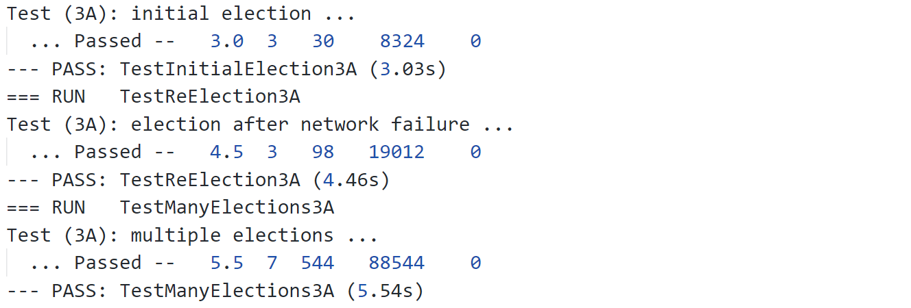
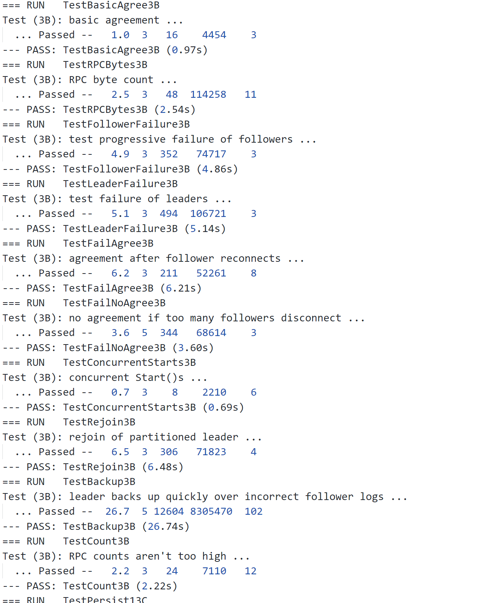
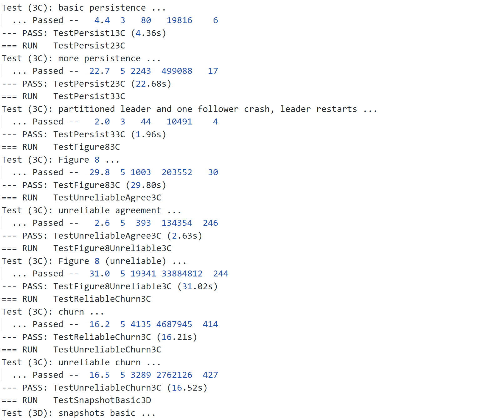
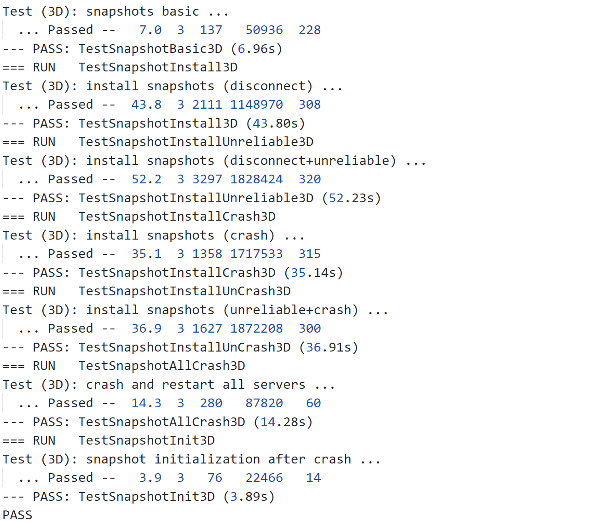

## shell

`delete.sh` 会删除产生的所有临时文件

```sh
bash delete.sh
```

`go-test-many.sh` 多次运行测试文件

产生 `test-x.err` 和 `test-x.log` 文件(x 表示序号)，前者会记录程序的日志(`log.Printf`)，后者记录样例输出 `fmt.Printf`，在终端会显示出错的序号，因此 debug 时根据序号去找对应的日志信息即可。

```sh
bash go-test-many.sh 100 100 3A
```

-   100 100 分别表示运行的次数和开启的多进程数量
-   3A 表示测试的函数名 (和 go test -run xx 中的 xx 意义相同)

`direct.sh` 是对 `go-test-many.sh` 上层做了一个封装，把`go-test-many.sh` 在终端输出信息重定向到 `output.txt` 文件中。

```sh
bash direct.sh 100 100 3A
```










## 问题 1: 之前 leader 开启的协程无法预期关闭

之前的判定方式

```go
    rf.mu.Lock()
    if rf.State != Leader{
        rf.mu.Unlock()
        break
    }
```

当前节点宕机(disconnect, 并且某个请求因为收发时间长导致阻塞)，但是该节点经过若干个 term 后重新当选 leader，此时会发生判断错误。

此类情况应该把该协程关闭

## 解决方案
-   传入 term 判断是否为当前任期下的 leader
-   可以通过该方法将该服务器下之前启用的 goroutine 关闭
```go
    rf.mu.Lock()
    if rf.State != Leader || rf.currentTerm != term{
        rf.mu.Unlock()
        break
    }
```

## 问题 2: 快照 RPC 和追加 RPC 存在死锁

在 appendEntries 函数中，我们发送该请求的前提是下标 start 不在 leader 的快照中 (`start > firstLog.Index`)

在监听 `nextIndex` 函数中是根据 `nextIndex[server] <= firstLog.Index` 决定是否发送快照 RPC

不妨假设 leader 为 A 节点，其中一个 Follower 为 B 节点

由于网络宕机缘故，A 刚当上 leader，nextIndex 设定为 37，而 firstLog.Index = 29

B 中的日志长度为 27 (包括了快照)

此时不会去发送 installSnapshot RPC (37 > 29)， 选择 appendEntries RPC，但是由于 B 节点日志长度过短导致回复后 start 会赋值为 27，而 27 < 29，此时不会选择继续发送 appendEntries

导致死锁，nextIndex 无法进行正常更新

## 解决方案: 

~~在 `monitorNextIndex` 函数启动后先发送一次 installSnapshot RPC~~

额外开启一个协程 `monitorSnapshot` 监听 `matchIndex[server]` 而不是 `nextIndex[server]`，因为新 leader 上台后 nextIndex 是初始化为 `len(rf.log)`，有概率会一直大于 snapshot 的 IncludedIndex。

而 matchIndex 表示已经和 leader 一致的下标，如果 follower 对应的 matchedIndex 小于 IncludedIndex，直接把快照发给他去同步即可 (可能已经一致了，但是 leader 一直没有确认罢了，因此只要发送一个消息过去确认即可)，此时就可以避免上面的死锁。

由于是定期查看是否发送消息，两个 monitor 函数(`monitorNextIndex`, `monitorSnapshot`) 需要使用 map 去重，防止发送相同的消息。`(start, end)` 和 `lastIncludedIndex` 分别作为键。如果想为了加速，可以设定协程数量上限，因为框架中模拟了网络长延时(随机)，可以多开几个协程发同一个消息，可以减小出现长延时的概率。raft 算法本身保证了幂等性，多个相同的日志/消息发送至服务端不会发送错误。

## 问题 3: 发现 follower 日志冲突时无法回退并且成功改变 commitIndex

## 解决方案: 

当 prevLog 和 follower 中日志 term 发生冲突找第一个等于冲突 Term 的日志时没有考虑其位于 snapshot 即首个日志，额外加上该判定条件即可。

漏了这个判定是因为 A,B,C 实验部分中第一个日志条目的 term = 0 和后面所有的条目 term 不相同，在搜索过程中是根据 `log[i].term != log[i + 1].term` 返回 i + 1，因此返回值至少为 1。而在快照中可能 term 和后面日志的 term 相同，导致搜索出问题，判定它日志一致，直接去更新 commitIndex。